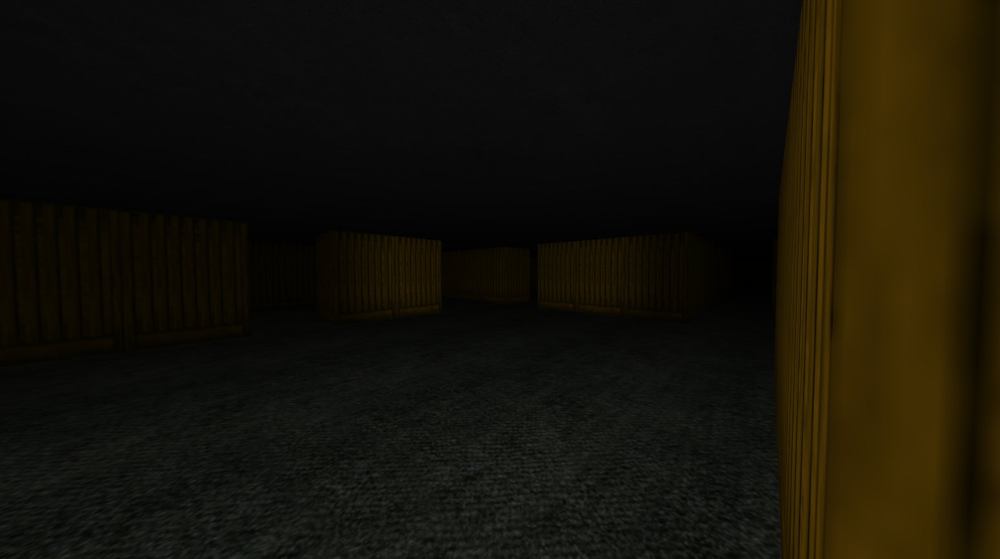

# MazeRunner 3D

> Projekt do předmětu **KIV/ZPG** – jednoduchá 3D hra postavená nad OpenTK.  
> Obsahuje pohyb hráče, svítilnu, kolize s prostředím a vykreslování na základě mapy.

---

## 🧠 Hlavní vlastnost
Volitelné argumenty:
- `--fullscreen` – spustí hru v režimu celé obrazovky
- `--mac` – aktivuje Retina režim (měřítko viewportu 2.0)

--
Volitelné argumenty:
- `--fullscreen` – spustí hru v režimu celé obrazovky
- `--mac` – aktivuje Retina režim (měřítko viewportu 2.0)

---

## 🔗 Repozitář

👉 [https://github.com/uzivatel/maze-runner](https://github.com/uzivatel/maze-runner)

---

## 🧑‍💻 Autor

Projekt vytvořen jako součást semestrální práce předmětu **KIV/ZPG** – Základy počítačové grafiky  
**[Tvé jméno / přezdívka]**  
Fakulta aplikovaných věd, Západočeská univerzita

---
-

## 📁 Struktura

- `ZPG/` – hlavní namespace se všemi třídami
  - `Player`, `Camera`, `MapReader`, `Model`, `Wall`, `Shader`, `Viewport`, ...
- `shaders/` – GLSL vertex a fragment shadery
- `textures/` – textury pro stěny, podlahy atd.
- `map.txt` – znaková mapa prostředí

---

## 🔗 Repozitář

👉 [https://github.com/uzivatel/maze-runner](https://github.com/uzivatel/maze-runner)

---

## 🧑‍💻 Autor

Projekt vytvořen jako součást semestrální práce předmětu **KIV/ZPG** – Základy počítačové grafiky  
**[Tvé jméno / přezdívka]**  
Fakulta aplikovaných věd, Západočeská univerzita

---
i

- 🌌 3D prostředí s kamerou z pohledu první osoby (FPS).
- 💡 Reflektor (baterka) vycházející z hráče s úhlem a kuželem světla.
- 📦 Detekce kolizí hráče proti trojúhelníkovému mesh modelu stěn.
- 🗺️ Načítání mapy ze souboru (znaková reprezentace).
- 🎮 Podpora myši a klávesnice (WASD + myš + mezerník).
- 🧱 Stěny, podlaha, strop s texturováním.

---

## ⌨️ Ovládání

| Klávesa         | Akce                      |
|-----------------|---------------------------|
| `W / A / S / D` | Pohyb vpřed/do stran      |
| `Myš`           | Otočení kamery            |
| `Space`         | Skok                      |
| `Esc`           | Uzamknutí/odemknutí myši  |
| `Alt + Enter`   | Přepnutí Fullscreen       |
| `Alt + Q`       | Ukončení                  |
| `Kolečko`       | Změna FOV (zoom)          |

---

## 🔧 Spuštění

Vyžaduje .NET 6.0+ a knihovnu [OpenTK](https://github.com/opentk/opentk).

Volitelné argumenty:
- `--fullscreen` – spustí hru v režimu celé obrazovky
- `--mac` – aktivuje Retina režim (měřítko viewportu 2.0)

---

## 📁 Struktura

- `ZPG/` – hlavní namespace se všemi třídami
  - `Player`, `Camera`, `MapReader`, `Model`, `Wall`, `Shader`, `Viewport`, ...
- `shaders/` – GLSL vertex a fragment shadery
- `textures/` – textury pro stěny, podlahy atd.
- `map.txt` – znaková mapa prostředí

---

## 🔗 Repozitář

👉 [https://github.com/uzivatel/maze-runner](https://github.com/uzivatel/maze-runner)

---

## 🧑‍💻 Autor

Projekt vytvořen jako součást semestrální práce předmětu **KIV/ZPG** – Základy počítačové grafiky  
**[Tvé jméno / přezdívka]**  
Fakulta aplikovaných věd, Západočeská univerzita

---
